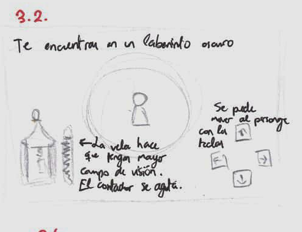
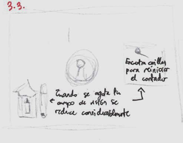
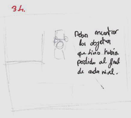

## Mirror of Contempt

Proyecto de Creación Multimedia Interactiva de la  Facultad de Bellas Artes de la Univesidad de Granada

# 1 Datos 

**Titulo** : Mirror of Contempt

**Web:**   (url github.io)

**Autor:**  Julia Sánchez López

**Resumen** : Livio es un niño que forma parte de la Iglesia de Cyric. Su objetivo es encontrar las reliquias que ha perdido en la oscuridad de la catedral

**Estilo/género:**  Juego RPG

**Logotipo** : 

**Resolución:** 1152x648px (reescalable)

**Probado en:**   Google Chrome  MS Edge y móviles android 

**Tamaño proyecto:** 102 MB 

**Licencia** Este proyecto tiene una Licencia CC Reconocimiento Compartir igual (CC BY-SA)

**Fecha** : 27/05/2026

**Medios**:

- Itch.io: [LINK](https://gyalia.itch.io/mirror-of-contempt-wip)
- Twitter: [Link](https://x.com/gyaliaa)
  

# 2. Memoria del proyecto 

### 2.1 Storyboard: 

El gameplay principal consiste en un laberinto dentro del templo, que unido con la oscuridad dificulta la movilidad del jugador. Para aumentar su campo de visión el jugador puede recoger cerillas que hay esparcidas por el mapa. El objetivo final es encontrar los objetos perdidos, en el caso del primer nivel, un libro de oraciones para poder cruzar la puerta y pasar al siguiente nivel. En un futuro me gustaría implementar un dialogo con otro personaje tras el primer nivel, además de un segundo nivel y una animación frame por frame que conecte el final con el inicio del juego.

  

### 2.2. Esquema de navegación 

# 3. Metodología

Metodología de desarrollo de productos multimedia basado en una metodología de UX (User Experience)

## Etapa 1: Ideación de proyecto

**Investigación de campo** (propuestas inspiradoras para el proyecto)

- Este juego esta muy inspirado en los juegos de el estudio portugues AstralShift, principalmente en [Pocket Mirror](https://store.steampowered.com/app/1899060/Pocket_Mirror__GoldenerTraum/?l=spanish) y [Little Goody Two Shoes](https://store.steampowered.com/app/1812370/Little_Goody_Two_Shoes/), los cuales acabo de terminar de jugar hace bastante poco y por elllo han influenciado claramente en mi idea e gameplay.
- La historia esta basada en la historia de un personaje que juego en una campaña de Dragones y Mazmorras al cual tengo especial cariño.

**Motivación de la propuesta** 

Queria probar hacer un juego al estilo de los juegos de RPG maker que me llevan años fascinando. Implementar la dinamica de la linterna es lo que me parece que hace este juego más interesante, pues he necesitado de un cronometro interno dentro de otro cronometro para que la imagen cambiara según iba corriendo la cuenta atrás.

**Publico / audiencia**

- Orientado a un público juvenil/adolescente

## Etapa 2: Desarrollo / actividades realizadas

El menu fue bastante sencillo. Las partes más complejas fueron el código del carrusel de la galareia que tras varios ajustes conseguí adaptar a mi proyecto y el botón de mute que no entendia del todo comno funcionaba la música al ser una global. Algo que me fastidió bastante es que al video no poder ser un mp4 se comió bastante la calidad y ha quedado bastante pixelado.
En cuanto el juego el sistema del tilemap y las animaciones del personaje jugable fueron bastante más sencillo de lo que esperaba gracias a la cantidad de tutoriales que encontré en internet. Fue la parte más tediosa pues fue lo que me consumió más tiempo pero fue bastante entretenido. 
La parte más compleja fue hacer que los objetos fuesen interactuables. El libro fue sencillo ya que funciona esencialmente como una llave, pero el sistema de las cerillas fue más complejo. Primero, el juego tenía que identificar cuando el personaje colisionaba especificamente con una cerilla. Esto activaba una cuenta atras que se muestra en una barra que va disminuyendo en la esquina inferior izquierda. Que comience esta cuenta atras hace a su vez que los sprites de la sombra y la lampara cambien y activen su propio timer interno para cambiar entre dos sprites y dar la sensación de una luz de vela.

## Etapa 3: Problemas identificados

Creo que el juego tiene 3 aspectos con los que no estoy completamente satisfecha:
-Video:El video que me gustaria añadir en la versión final es una animación, pero por falta de tiempo decidí añadir un video que no es personalizado como introducción a la sección de "Historia" y no me convence del todo. Además, ya he mencionado la mala cálidad.

-Tiempos:Debido a los efectos de sonido, cuando interactuas con algo que hace ruido hay que esperar a que acabe el efecto por completo o si no se cportaban, lo que puede crear tiempos de espera algo largos.

-Sistema de dialogos:

# 4. Conclusiones 

Hacer un juego de este estilo ha sido más sencillo de lo que esperaba. Mucha gente de mi alrededor me han pedido el nombre del programa al ver lo que estaba haciendo porque les gustaría intentar probar a hacer sus propios proyectos. Lo que siento que me ha faltado para tener un resultado con el que estoy 100% satisfecha es tiemnpo ya que las otras asignaturas de la carrear me han dado bastante carga de trabajo. En un futuro como he mencionado quiero mejorar los dialogos y añadir más cantidad, además de añadir un segundo laberinto y una animación propia como video que concluya bien el proyecto.

# 5 Referencias 

**Artículos y blogs** 

- Crofts, S., Fox, M., Retsema, A. and Williams, B. (2005) *Podcasting: A new technology in search of viable business models*First Monday, 10(9). https://doi.org/10.5210/fm.v10i9.1273. Recuperado el 8 de abril de 2020 de: https://journals.uic.edu/ojs/index.php/fm/article/view/1273/1193

**Recursos y materiales audiovisuales:**

* Musica:  Adriane Lencker
* Imágenes:  Originales, por Julia Sánchez López
* Tipografía: Google Fonts:[EB Garamond](https://fonts.google.com/specimen/EB+Garamond?selection.family=EB+Garamond:ital,wght@0,400..800;1,400..800|Iosevka+Charon:ital,wght@0,300;0,400;0,500;0,700;1,300;1,400;1,500;1,700|Macondo), [Iosevka Charon](https://fonts.google.com/specimen/Iosevka+Charon?selection.family=EB+Garamond:ital,wght@0,400..800;1,400..800|Iosevka+Charon:ital,wght@0,300;0,400;0,500;0,700;1,300;1,400;1,500;1,700|Macondo) y [Makondo](https://fonts.google.com/specimen/Macondo?selection.family=EB+Garamond:ital,wght@0,400..800;1,400..800|Iosevka+Charon:ital,wght@0,300;0,400;0,500;0,700;1,300;1,400;1,500;1,700|Macondo&preview.script=Latn)
* Video: Tome de base este video de [youtube](https://www.youtube.com/watch?v=ZQH--ZGgXe4) que después edité.
* Tilemap: [diesnight](https://diednight.itch.io/the-church-based-tileset-a-little-something-for-you)

**Herramientas utilizadas**

- Godot Engine 4.3
- Dialogic 2

  </small>

Mayo 2026
