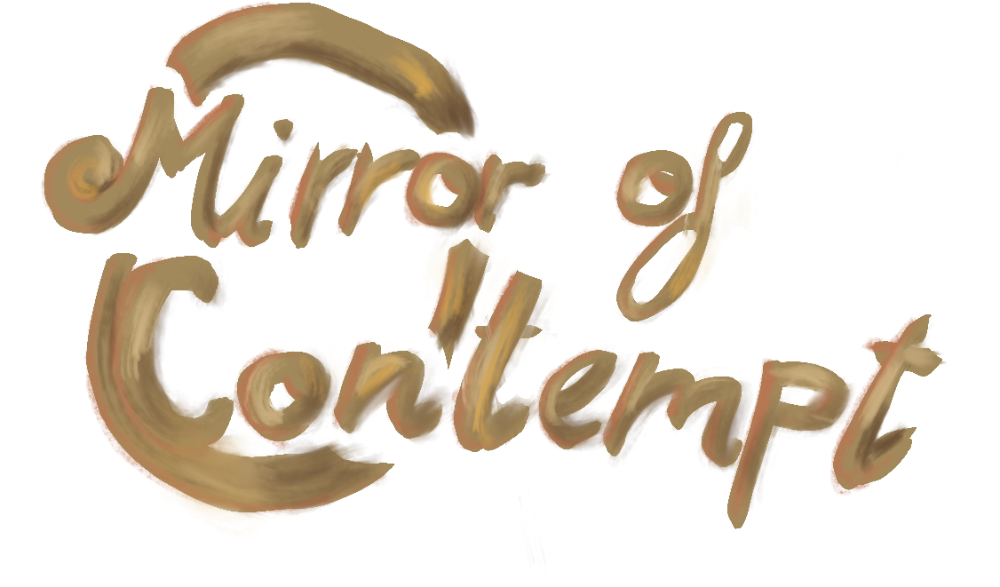
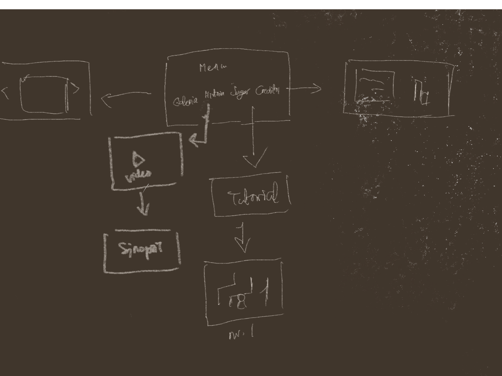

## Mirror of Contempt

Proyecto de Creación Multimedia Interactiva de la  Facultad de Bellas Artes de la Univesidad de Granada

# 1 Datos 

**Titulo** : Mirror of Contempt

**Web:**   (url github.io)

**Autor:**  Julia Sánchez López

**Resumen** : Livio es un niño que forma parte de la Iglesia de Cyric. Su objetivo es encontrar las reliquias que ha perdido en la oscuridad de la catedral

**Estilo/género:**  Juego RPG

**Logotipo** : 

**Resolución:** 1152x648px (reescalable)

**Probado en:**   (indicar dónde has probado que funciona: ej. Google Chrome / MS Edge... /móviles android )

**Tamaño proyecto:** 102 MB 

**Licencia** Este proyecto tiene una Licencia CC Reconocimiento Compartir igual (CC BY-SA)

**Fecha** : 27/05/2026

**Medios**:

- Itch.io: [LINK](https://gyalia.itch.io/mirror-of-contempt-wip)
- Twitter: [Link](https://x.com/gyaliaa)
  

# 2. Memoria del proyecto 

### 2.1 Storyboard: 

(narra brevemente lo que sucede en tu proyecto, puedes usar 3-4 imágenes de apoyo)

### 2.2. Esquema de navegación 

# 3. Metodología

Metodología de desarrollo de productos multimedia basado en una metodología de UX (User Experience)

## Etapa 1: Ideación de proyecto

**Investigación de campo** (propuestas inspiradoras para el proyecto)

- Portfolio [Leonardi Web page](http://www.rleonardi.com/interactive-resume/) para idear cómo organizar el material
- 

**Motivación de la propuesta** 

Este  proyecto es interesante porque ... 

**Publico / audiencia**

- Orientado a 

## Etapa 2: Desarrollo / actividades realizadas

(qué soluciones has planteado y cómo se han resuelto: juego, galería de fotos, grabación de video, etc.)

- Juego. 
- Video 
- Instrucciones y ayuda al usuario 
- Menús y elementos de navegación (botones)
- etc.

## Etapa 3: Problemas identificados

(que consideras que no  funciona correctamente y por qué )

# 4. Conclusiones 

(explica brevemente tu valoración, problemas que has detectado y que te gustaría hacer o mejorar en el futuro )

# 5 Referencias 

**Artículos y blogs** 

- Crofts, S., Fox, M., Retsema, A. and Williams, B. (2005) *Podcasting: A new technology in search of viable business models*First Monday, 10(9). https://doi.org/10.5210/fm.v10i9.1273. Recuperado el 8 de abril de 2020 de: https://journals.uic.edu/ojs/index.php/fm/article/view/1273/1193

**Recursos y materiales audiovisuales:**

* Musica:  
* Imágenes:  Originales, por Julia Sánchez López
* Tipografía:
* Video:
* Tilemap:

**Herramientas utilizadas**

- Godot Engine 4.x
- Dialogic 2

  </small>

Mayo 2026
